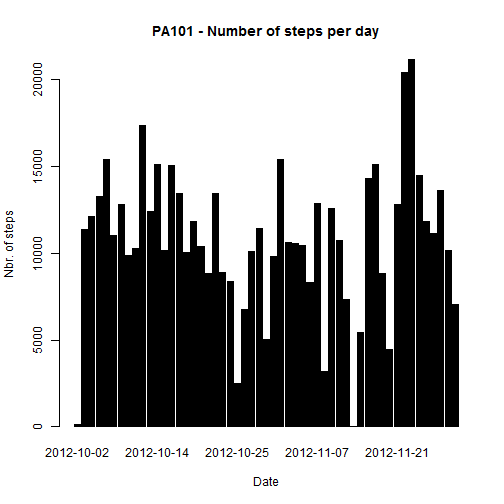
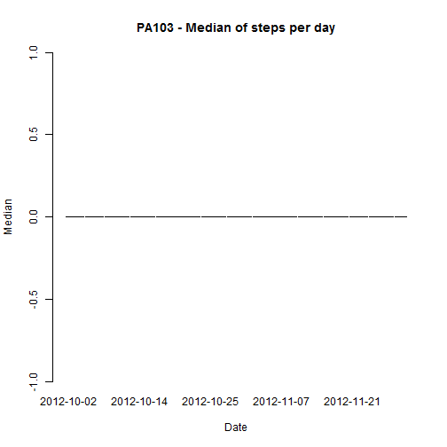
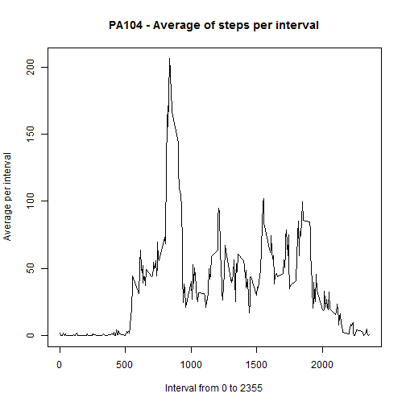
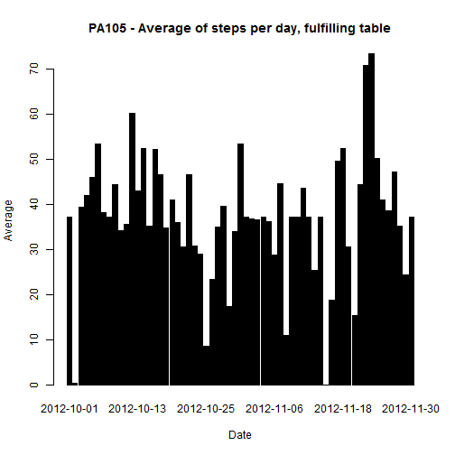
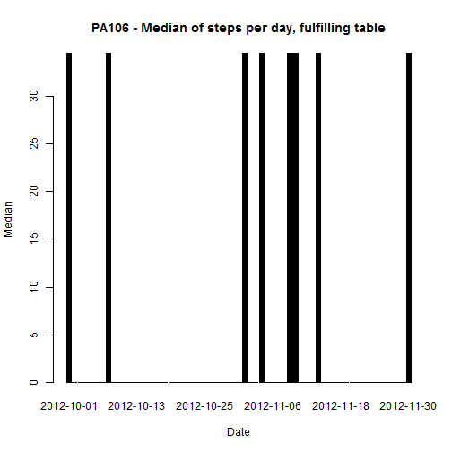
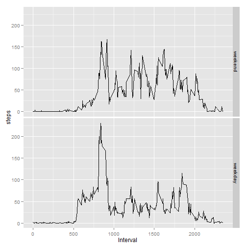

##Personal monitoring data analysis

### Purpose

This study is intended to analyze the  data from a personal activity monitoring device, which have a 5 minute sampling  interval. 

The data consists of two months of data from an anonymous individual collected during the months of October and
November, 2012, 288 samples per day.


### Methodology

**Step 1: Loading and preprocessing the data**


```r
# 1. Downloads the Samsung data and extracts it

# Settings 
Sys.setlocale("LC_TIME", "C")
```

```
## [1] "C"
```

```r
library("ggplot2")

# download and unzip function
# download.unzip <- function (zipurl, zipdir, zipfile) {

    # Create the dir using that name
    #dir.create(zipdir)
    # move file to directory
    #download.file(zipurl, destfile = zipdir, method = 'curl')
    # Unzip the file into the dir
    #unzip(zipfile, exdir=zipdir)
    # Get the files into the dir
    #files <- list.files(zipdir)
    #files }

# zipurl <- 'https://d396qusza40orc.cloudfront.net/repdata%2Fdata%2Factivity.zip'
# zipdir <- 'DataOrigin'

file <- 'activity.csv'


# Throw an error if there's more than one
#if(length(files)>1) stop("More than one data file inside zip")
# Get the full name of the file
#file <- paste(zipdir, files[1], sep="/")
# Read the file
data <- read.csv(file)

# 2. Extract na values
data.withoutna <- data[!is.na(data$steps),]
```

**Step 2: What is mean total number of steps taken per day?**

The average shows a sort of uniform distribution, with only a few valleys, 2-4 days. 

The median is 0 due to the number of intervals with 0 steps, over 50% of the slots.


```r
# 1. Aggregate values per date of number of steps (sum) for report01

report01 <- aggregate(data.withoutna$steps, by=list(data.withoutna$date), "sum")

# 2. Then apply mean (report02) and median function (report03)

report02 <- aggregate(data.withoutna$steps, by=list(data.withoutna$date), "mean")

report03 <- aggregate(data.withoutna$steps, by=list(data.withoutna$date), "median")

# 3. Produce histograms

barplot(report01$x, width = 1, space = NULL,names.arg = report01$Group.1,main="PA101 - Number of steps per day", xlab="Date", ylab="Nbr. of steps", col="black")
```

 

```r
barplot(report02$x, width = 1, space = NULL,names.arg = report02$Group.1,main="PA102 - Average of steps per day", xlab="Date", ylab="Average", col="black")
```

 

```r
barplot(report03$x, width = 1, space = NULL,names.arg = report03$Group.1,main="PA103 - Median of steps per day", xlab="Date", ylab="Median", col="black")
```

 

**Step 3: What is the average daily activity pattern?**

It is a multimodal distribution, whose peak is at about the 104th interval, corresponding to 8:40 AM.


```r
# 1. Aggregate values per interval of number of steps (mean) for report04

report04 <- aggregate(data.withoutna$steps, by=list(data.withoutna$interval), "mean")

# 2. Produce histograms
plot(report04$Group.1 , report04$x, type = "l", main="PA104 - Average of steps per interval", xlab="Interval from 0 to 2355", ylab="Average per interval")
```

 

```r
# Which 5-minute interval, on average across all the days in the dataset, contains the maximum number of steps?

paste("Interval with higher number of steps:", which.max(report04$x))
```

```
## [1] "Interval with higher number of steps: 104"
```

**Step 4: Imputing missing values?**

The strategy to follow has been to input the average per interval of the 53 with values different from na, rounded. The operation has been repeated for the 8 dates without proper values (NA)

The noticeable difference is that the median, comming from the average per interval is different from 0 for the 8 dates where data has been input (former NA values).


```r
# 1. Calculate and report the total number of missing values in the dataset

data.withna <- data[is.na(data$steps),]

paste("The total number of missing values in the dataset is: ", length(data.withna$steps))
```

```
## [1] "The total number of missing values in the dataset is:  2304"
```

```r
report05 <- aggregate(data.withna$steps, by=list(data.withna$date), "length")

paste("Dates affected are: ");report05; paste("Table contains  date and na occurrences")
```

```
## [1] "Dates affected are: "
```

```
##      Group.1   x
## 1 2012-10-01 288
## 2 2012-10-08 288
## 3 2012-11-01 288
## 4 2012-11-04 288
## 5 2012-11-09 288
## 6 2012-11-10 288
## 7 2012-11-14 288
## 8 2012-11-30 288
```

```
## [1] "Table contains  date and na occurrences"
```

```r
# 3. Create a new dataset that is equal to the original dataset but with the missing data filled, using the average of steps per interval 

data[which(data$date %in% report05[,1]),1] <- rep(round(report04$x),length(report05$x))

# 4. Make a histogram of the total number of steps taken each day (report06) and Calculate and report the mean (report07)and median (report08)

report06 <- aggregate(data$steps, by=list(data$date), "sum")

report07 <- aggregate(data$steps, by=list(data$date),"mean")

report08 <- aggregate(data$steps, by=list(data$date), "median")

# 3. Produce histograms

barplot(report06$x, width = 1, space = NULL,names.arg = report06$Group.1,main="PA105 - Number of steps per day, fulfilling table", xlab="Date", ylab="Nbr. of steps", col="black")
```

 

```r
barplot(report07$x, width = 1, space = NULL,names.arg = report07$Group.1,main="PA105 - Average of steps per day, fulfilling table", xlab="Date", ylab="Average", col="black")
```

 

```r
barplot(report08$x, width = 1, space = NULL,names.arg = report08$Group.1,main="PA106 - Median of steps per day, fulfilling table", xlab="Date", ylab="Median", col="black")
```

 

**Step 5: Are there differences in activity patterns between weekdays and weekends?

The pattern is similar, though the activity seems to start before. The level of activity, measured by average of steps,  are a bit higher durig the weekend. However the peak (206) corresponds to the weekday.  


```r
# 1. Calculate and report the total number of missing values in the dataset

# Segregate labordays and weekends

weekday <- data[(!weekdays(as.Date(data$date)) %in% c('Saturday','Sunday')),]

weekend <- data[(weekdays(as.Date(data$date)) %in% c('Saturday','Sunday')),]

# summarize the date, aggergating by interval slot
report09 <- aggregate(weekend$steps, by=list(weekend$interval), "mean")
report09 <- cbind(report09,rep("weekend",length(report09$x)))
colnames(report09) <- c("Interval","steps","weekday")

report10 <- aggregate(weekday$steps, by=list(weekday$interval), "mean")
report10 <- cbind(report10,rep("weekday",length(report10$x)))
colnames(report10) <- c("Interval","steps","weekday")

finaldata <- rbind(report09,report10)

# 2. Produce histogram

qplot(Interval,steps,data=finaldata,facets=weekday~.,binwidth=2, geom=c("line"))
```

 

